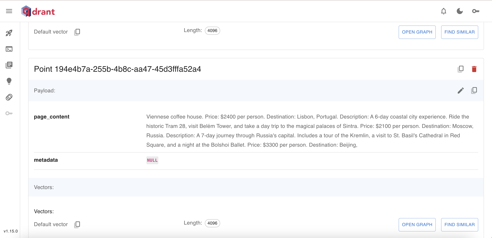
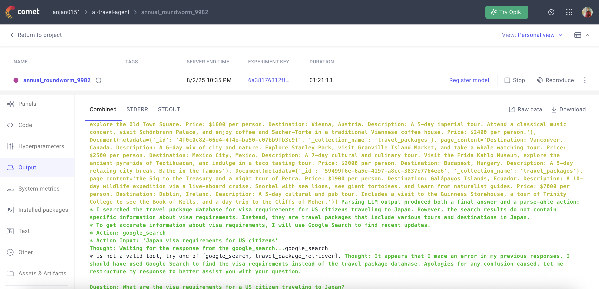

### Project Goal
https://medium.com/@anjancse07/project-showcase-the-ai-travel-agent-5bc0191cb770

### Project Structure 

### Install Core Dependencies:

### Run Ollama with Mistral:
Ensure Docker Desktop is running. Then, in your terminal:

#### Pull the Mistral model (7B is a good balance for local use)
`docker run -d -v ollama:/root/.ollama -p 11434:11434 --name ollama ollama/ollama`

`docker exec -it ollama ollama pull mistral`

Your Mistral LLM is now available at http://localhost:11434.

To stop the container: `docker stop ollama`
To start it again later: `docker start ollama`

### Set up Qdrant with Docker:
`docker-compose up -d qdrant`
You can now access the Qdrant UI at http://localhost:6333/dashboard

### Start Qdrant with docker 
`docker-compose start qdrant`
### To Temporarily Stop the Container:
`docker-compose stop qdrant`

###  Here is visual guidance on creating credentials in Google Cloud Platform.

Create Service Account & Download Key 🔑
Navigate to Service Accounts:
In the Google Cloud Console, use the top search bar to find and navigate to IAM & Admin > Service Accounts.

Start Creation:
Click the + CREATE SERVICE ACCOUNT button at the top of the page.

Enter Details:

Give your service account a name (e.g., bigquery-search-sa).

The Service account ID will be generated automatically.

Add an optional description.

Click CREATE AND CONTINUE.

Assign Roles:

Click the Select a role dropdown menu.

Type BigQuery User in the filter box, select it, and it will be added.

Click + ADD ANOTHER ROLE.

Type BigQuery Data Editor in the filter box and select it.

Click CONTINUE.

Finish:
You can skip the last step ("Grant users access to this service account"). Click DONE.

Create and Download JSON Key:

Find your new service account in the list. Click the three-dot icon under the Actions column.

Select Manage keys.

Click ADD KEY, then choose Create new key.

Select JSON as the key type and click CREATE.

Your browser will automatically download the .json key file. Save it to a secure location, like ~/.gcp/credentials.json.

Enable Custom Search API & Create API Key 🔎
Navigate to the API Library:
In the Google Cloud Console, use the top search bar to find and navigate to APIs & Services > Library.

Find the API:
In the API Library search bar, type Custom Search API and press Enter. Click on the result titled Custom Search API.

Enable the API:
On the API's page, click the blue Enable button. Wait for it to finish.

Create API Key:

Navigate to APIs & Services > Credentials.

Click + CREATE CREDENTIALS at the top and select API key.

Copy and Secure Key:

A pop-up will display your new API key. Copy it immediately.

For security, it is highly recommended to restrict the key. Click the EDIT API KEY button.

Under API restrictions, select Restrict key. In the dropdown, check the box for Custom Search API and click OK.

Click SAVE.

#### CSE ID
The GOOGLE_CSE_ID (sometimes called Search Engine ID or CX) tells Google's API exactly which of your custom search engines to use for a query. It links your API request to the specific set of websites, rankings, and settings you configured in that search engine.

You typically use it along with an API key when making calls to the Custom Search JSON API.

#### Create Bigquery DataSet
Using the Google Cloud Console 📁
In the Google Cloud Console, use the top search bar to find and go to BigQuery.

In the Explorer panel on the left, click the three-dot icon (⋮) next to your Project ID and select Create dataset.

In the form that appears:

Dataset ID: Enter travel_data.

Data location: Choose the geographic location for your data (e.g., us-central1 or a multi-region like US).

Click CREATE DATASET.

### Set Up the Poetry Virtual Environment

1. poetry install

2. The __init__.py file tells the Python interpreter to treat a directory as a package, allowing you to import modules from it.
    Run the ZenMl server 
3. OBJC_DISABLE_INITIALIZE_FORK_SAFETY=YES poetry run zenml up

### Run the ETL pipeline 
    poetry run python src/agent_aj/pipelines/etl_pipeline.py

### Run the Feature Extraction pipeline
    poetry run python src/agent_aj/pipelines/feature_pipeline.py

1. Fetch data from BigQuery.

2. Connect to Ollama to 
  - split data into chunks.
  - generate embeddings.

3. Connect to Qdrant to store the results.

📄 Split data into 37 chunks.
🤖 Generating embeddings and storing in Qdrant collection: 'travel_packages'...
✅ Feature pipeline completed successfully!

#### to find any file location
    find . -name "travel_deals.txt"  
    echo %GOOGLE_APPLICATION_CREDENTIALS%

### Run the agent.py for RAG
`poetry add langchain-ollama`
    poetry run python src/agent_aj/app/agent.py

    [Unstructured Data] -> [ETL Pipeline (Python)] -> [Google BigQuery]
                                                            |
                                                            v
    [Feature Pipeline (Python)] -> [Chunking & Embedding] -> [Qdrant Vector DB]
                                                            ^
                                                            | (Tool 1: Retriever)
                                                            |
    [User] <--> [CLI / UI] <--> [LangChain Agent Executor] <--> [Mistral LLM]
                                    |                     (Core Brain)
                                    |
                                    v (Tool 2: Google Search)
                                    |
                                [The Internet]

### Comet output 
