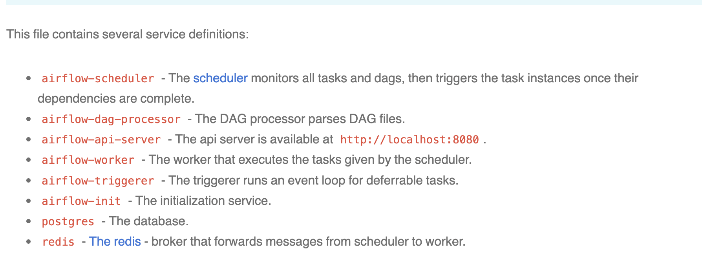
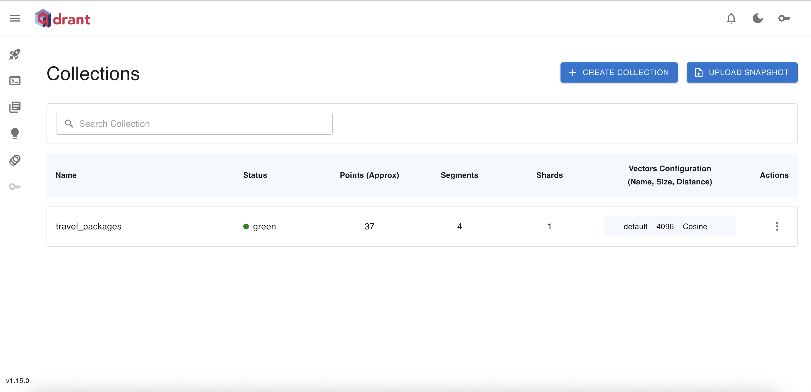
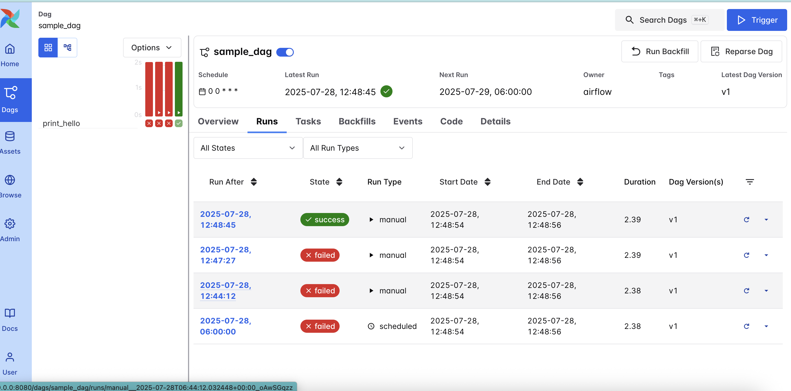

### Project Structure 
LLMAgent/
├── .env
├── pyproject.toml
├── poetry.lock
├── sample_notebook.ipynb
└── README.md (optional)

### Step 1: Create a New Poetry Project
1. Open a terminal and create a new directory for your project
2. Initialize a new Poetry project
`poetry init`
3. Add Required Dependencies
- poetry add `langchain `
- poetry add `python-dotenv `
- poetry add `huggingface_hub` 
- poetry add `googlesearch-results` 
- poetry add `tiktoken`
- poetry add `jupyter`  # Required for running .ipynb files

### Set Up the Poetry Virtual Environment
poetry shell

## ! Conda oprions
### Conda version
conda --version
#### Export the dependencies to ENV.txt file 
poetry export -f requirements.txt --output requirements.txt --without-hashes

#### Conda environment list 
conda env list
base                  *  /opt/anaconda3
LLMAgentEnv              /opt/anaconda3/envs/LLMAgentEnv
conda activate LLMAgentEnv

#### Conda create new env from existing yml dependencies 
conda env create -n LLMAgentEnv --file /Users/anjandebnath/Documents/PythonWorkspace/LLMAgent/environment.yml

#### Launch Navigator from Terminal
anaconda-navigator

## Project Structure 

1. poetry install

2. The __init__.py file tells the Python interpreter to treat a directory as a package, allowing you to import modules from it.
    Run the ZenMl server 
3. OBJC_DISABLE_INITIALIZE_FORK_SAFETY=YES poetry run zenml up
4. poetry run python run_pipeline.py
5. ETL pipeline: Dashboard URL for Pipeline Run: http://127.0.0.1:8237/projects/default/runs/8ba73d94-532a-4e79-b019-c03d64986f51

6. MongoDB connect: mongodb://localhost:27017

